# FOUND IT

## Description

_Duration: 2 Week Sprint_

 **Found it** is an app that will help the user find things that they may not otherwise find in storage or when moving. With a simple interface, the user can easily add items physically and virtually on personalized named boxes when they are packing and placing that box in their specific location. The user just has to print out a unique **QR code** which I gave to each box in the app and stick it onto the box. The user can look through the boxes virtually and search for an item to know what box it is inside after it has been taped. While normally using human eyes to look inside, using this app you can type in the items of what is in each box to reference later. Users can quickly scan the QR code right on the box, and it will guide to the link of that box on their virtual web storage space. Not stopping there, the user can edit things that they have been added and removed from the box. When the user makes progress and finishes unpacking a specific box, they can delete that box easily just with a click. 

 To see the fully functional site, please visit: [Found it](https://f0undit.herokuapp.com)

 ## Screen Shot
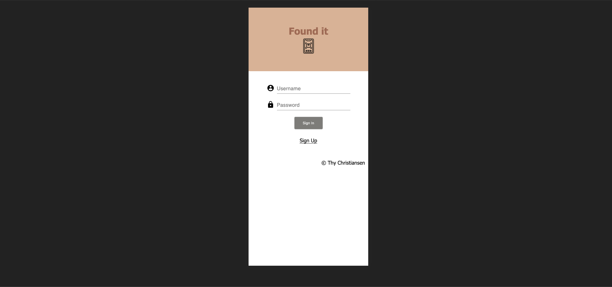

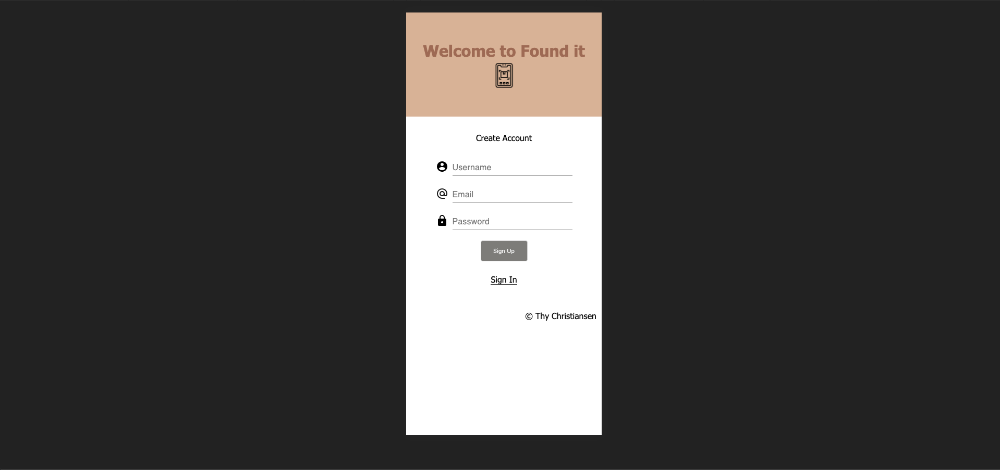

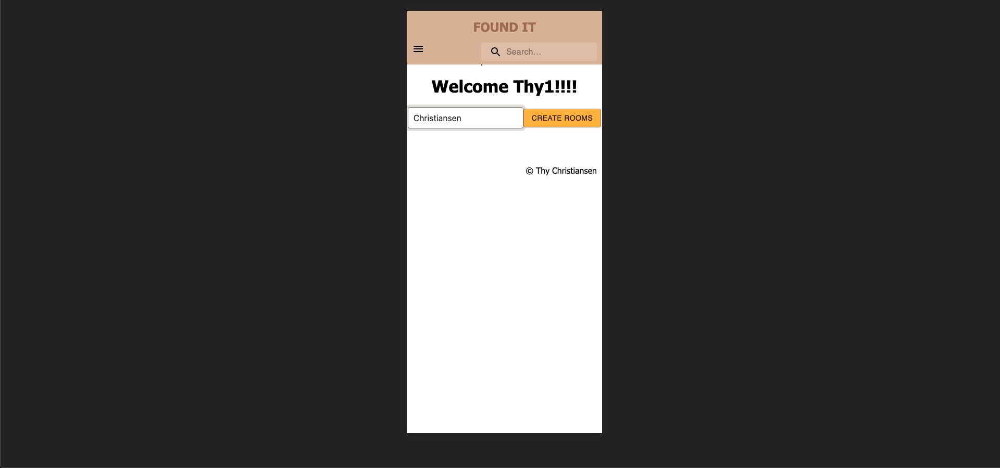

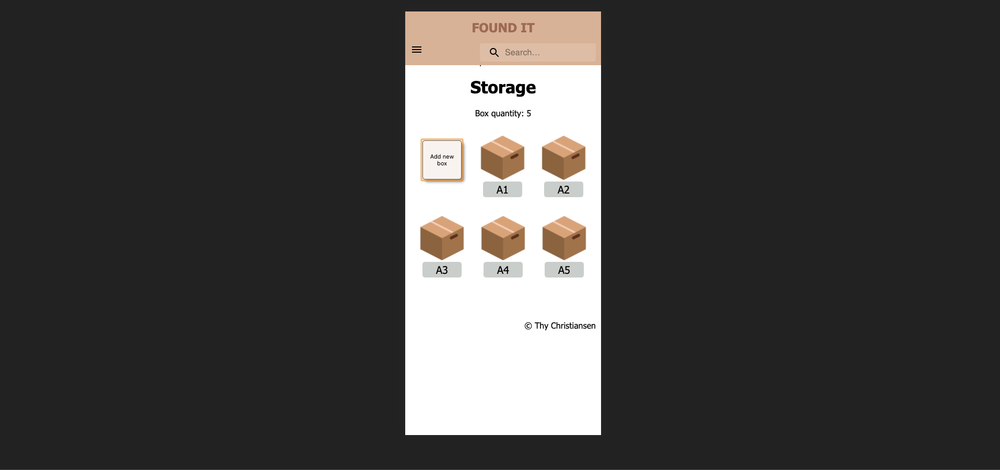

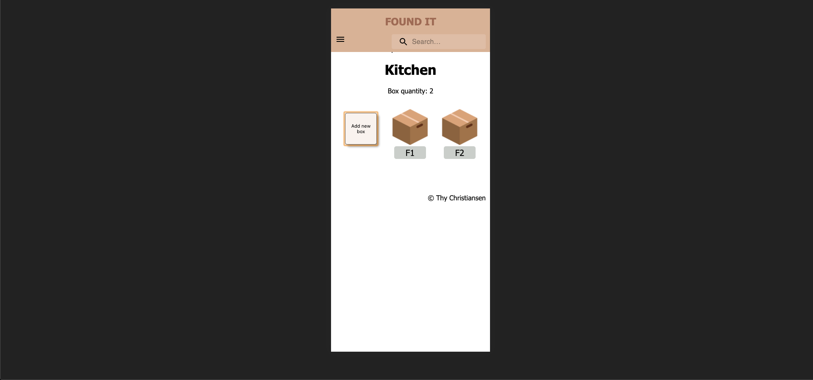

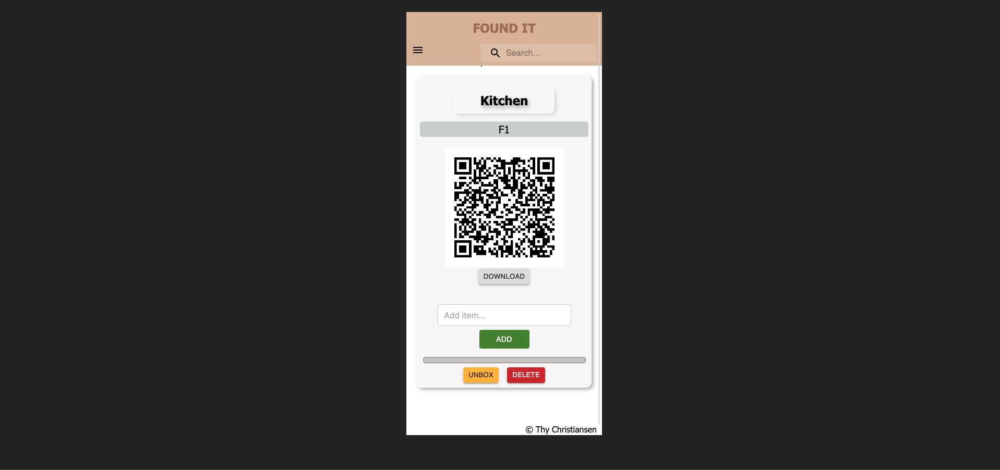

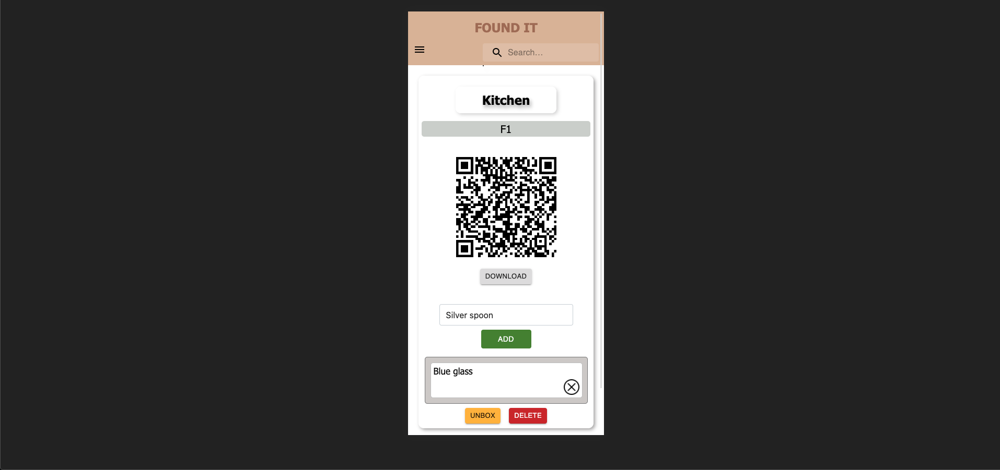

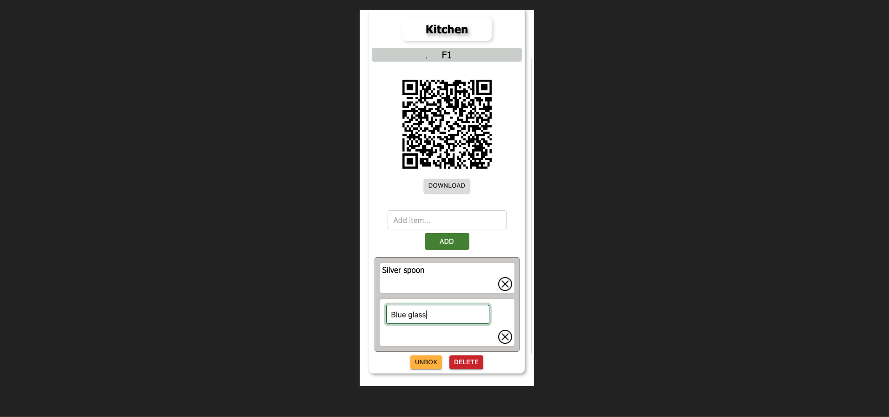

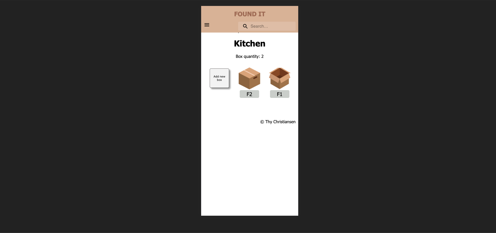

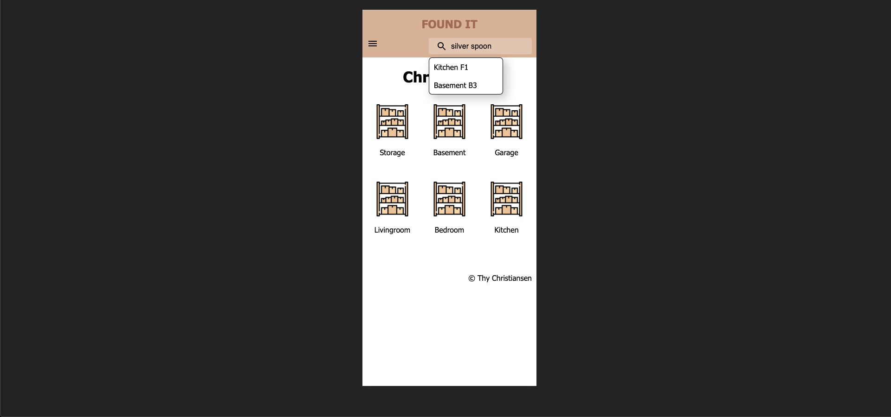

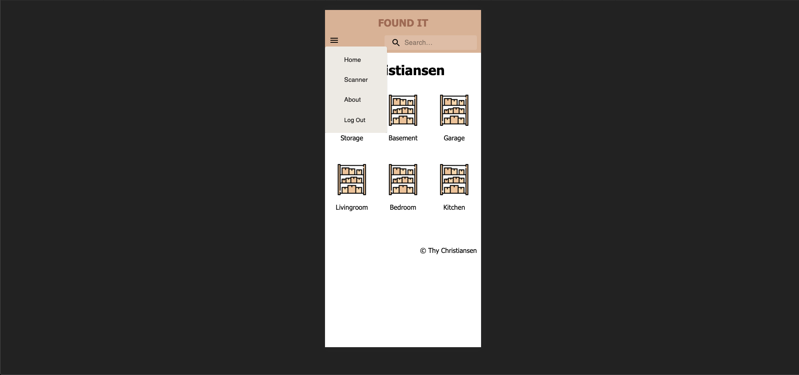

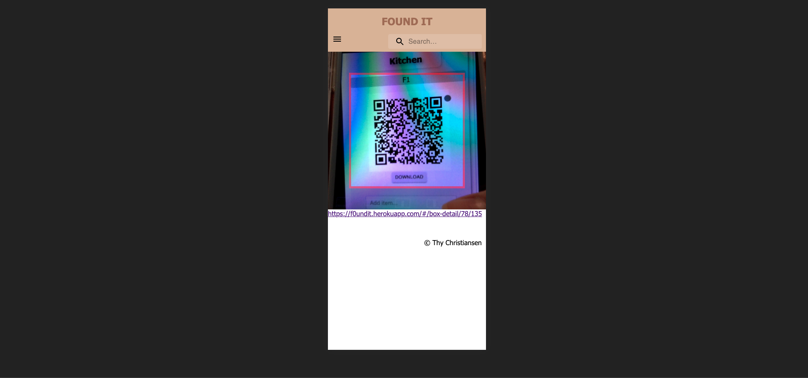

### Prerequisites

Link to software that is required to install the app (e.g. node).

- [Node.js](https://nodejs.org/en/)
- [PostrgeSQL](https://www.postgresql.org/)
- [Nodemon](https://nodemon.io/)

## Built With
HTML | CSS | Node | Express | React | Redux | Sagas | Postico PostgreSQL | Passport | Heroku PostgreSQL | AWS, S3 bucket | Google API | Nodemailer | Material-UI | SweetAlert2

## Acknowledgement
Thanks to [Prime Digital Academy](www.primeacademy.io) who equipped and helped me to make this application a reality. Thank Dane, Dev and Chris Black instructor for helping me during the time I create the app so that I could complete the app. 

## Support
If you have suggestions or issues, please email me at [thyvu0411@gmail.com](www.google.com)
